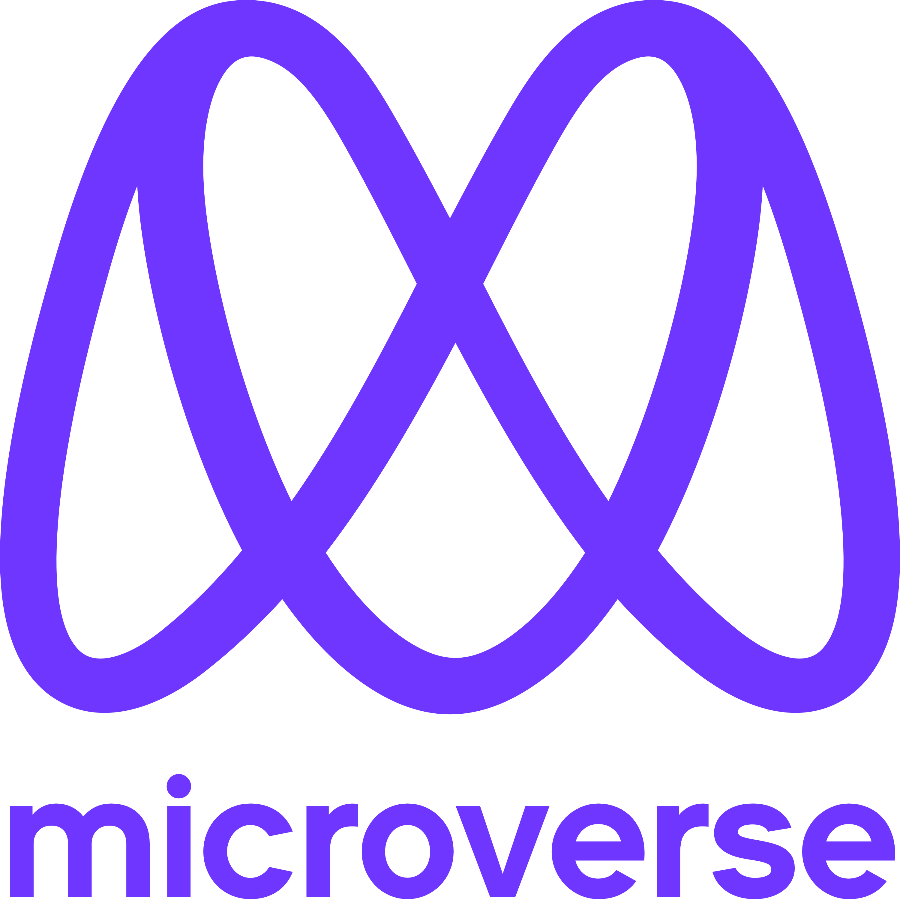

<a name="readme-top"></a>
<div align="center">

  
  <br/>

  <h3><b>HELLO MICROVERSE</b></h3>

</div>

<!-- TABLE OF CONTENTS -->

# 📗 Table of Contents

- [📗 Table of Contents](#-table-of-contents)
- [📖 \[HELLO\_MICROVERSE\] ](#-hello_microverse-)
  - [🛠 Built With ](#-built-with-)
    - [Tech Stack ](#tech-stack-)
    - [Key Features ](#key-features-)
  - [🚀 Live Demo ](#-live-demo-)
  - [💻 Getting Started ](#-getting-started-)
    - [Prerequisites](#prerequisites)
    - [Setup](#setup)
    - [Install](#install)
    - [Usage](#usage)
  - [👥 Authors ](#-authors-)
  - [🔭 Future Features ](#-future-features-)
  - [🤝 Contributing ](#-contributing-)
  - [⭐️ Show your support ](#️-show-your-support-)
  - [🙏 Acknowledgments ](#-acknowledgments-)
  - [❓ FAQ ](#-faq-)
  - [📝 License ](#-license-)


# 📖 [HELLO_MICROVERSE] <a name="about-project"></a>

> This Project is a Welcome Project for Microverse
>       <br><b> Module One day 2 Project [solo]</b>

**[HELLO_MICROVERSE]** is a...

## 🛠 Built With <a name="built-with"></a>

### Tech Stack <a name="tech-stack"></a>


<details>
  <summary>Client</summary>
  <ul>
    <li><a href="https://w3school.com/">HTML</a></li>
  </ul>
</details>


<!-- Features -->

### Key Features <a name="key-features"></a>

> THIS IS A SIMPLE HELLO WORLD APP FOR NOW


<p align="right">(<a href="#readme-top">back to top</a>)</p>

<!-- LIVE DEMO -->

## 🚀 Live Demo <a name="live-demo"></a>

> NOT AVAILABLE RIGHT NOW


<p align="right">(<a href="#readme-top">back to top</a>)</p>

<!-- GETTING STARTED -->

## 💻 Getting Started <a name="getting-started"></a>

> A new Developer can use this as a template to create other html project with right setup for javascript 

To get a local copy up and running, follow these steps.

### Prerequisites

In order to run this project you need:
  - NODE 
  - ESlint set up

### Setup
- install node and eslint
 

```sh
  npm install eslint
  npx eslint --init
```
<br><br>


### Install

Install this project with:

Clone this repository to your desired folder:


 commands:

```sh
  git clone https://github.com/roniy68/hello-world.git
  cd hello-world
  npm install -y
```
<br><br>

### Usage

To run the project, execute the following command:


-install serve with : npm install -g serve

```sh
  serve -s .
```

<p align="right">(<a href="#readme-top">back to top</a>)</p>

<!-- AUTHORS -->

## 👥 Authors <a name="authors"></a>

👤 **Author1**

- GitHub: [@roniy68](https://github.com/roniy68)
- Twitter: [@ahroniy](https://twitter.com/ahroniy)
- LinkedIn: [LinkedIn](https://linkedin.com/in/ahroniy)


<p align="right">(<a href="#readme-top">back to top</a>)</p>

<!-- FUTURE FEATURES -->

## 🔭 Future Features <a name="future-features"></a>

>  1 - 3 features I will add to the project.

- [ ] **[javascript]**
- [ ] **[frontend]**
- [ ] **[backend]**

<p align="right">(<a href="#readme-top">back to top</a>)</p>

<!-- CONTRIBUTING -->

## 🤝 Contributing <a name="contributing"></a>

Contributions, issues, and feature requests are welcome!

Feel free to check the [issues page](../../issues/).

<p align="right">(<a href="#readme-top">back to top</a>)</p>

<!-- SUPPORT -->

## ⭐️ Show your support <a name="support"></a>

> In this Project I learned How to submit code the right way. 

If you like this project...

<p align="right">(<a href="#readme-top">back to top</a>)</p>

<!-- ACKNOWLEDGEMENTS -->

## 🙏 Acknowledgments <a name="acknowledgements"></a>


I would like to thank Microverse and their code reviewers to make this readme happen 

<p align="right">(<a href="#readme-top">back to top</a>)</p>


<!-- LICENSE -->

## 📝 License <a name="license"></a>

This project is [MIT](./LICENSE) licensed.

_NOTE: we recommend using the [MIT license](https://choosealicense.com/licenses/mit/) - you can set it up quickly by [using templates available on GitHub](https://docs.github.com/en/communities/setting-up-your-project-for-healthy-contributions/adding-a-license-to-a-repository). You can also use [any other license](https://choosealicense.com/licenses/) if you wish._

<p align="right">(<a href="#readme-top">back to top</a>)</p>
